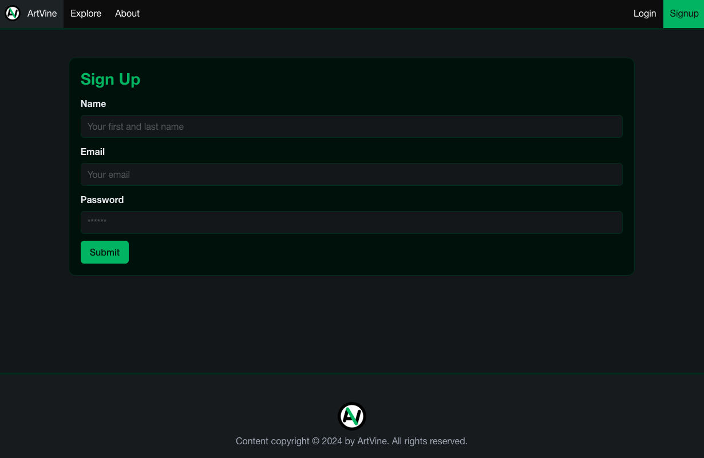

# ArtVine

[](https://opensource.org/licenses/MIT)

ArtVine is a platform designed to connect artists with art enthusiasts. It enables artists to showcase their portfolios and build a following. Users can browse collections and save to their own library, fostering a community that supports creative talent.

## Description
ArtVine bridges the gap between artists and enthusiasts by providing an intuitive platform for:
- Showcasing and managing artist portfolios.
- Engaging with a community of art enthusiasts through a personal library.  
The platform is designed with scalability in mind and provides an optimized user experience on both desktop and mobile devices.

## Table of Contents
- [Features](#features)
- [Technologies Used](#technologies-used)
- [Installation](#installation)
- [Usage](#usage)
- [Future Developement](#future-development)
- [Contributing](#contributing)
- [License](#license)
- [Tests](#tests)
- [Questions?](#questions)

## Features
1. Artist Portfolios
- Upload and manage artwork galleries.
- Add descriptions and tags to pieces for better discoverability.
2. Library
- See something cool? Put it your library so you always know where to find it.
3. Explore
- Search the database by author, tag, or user.
4. Responsive Design
- Mobile-friendly and accessible UI for all users.

## Technologies Used
- Front-End: React, Apollo Client
- Back-End: Node.js, Express.js, GraphQL, MongoDB (with Mongoose ODM)
- Authentication: JSON Web Tokens (JWT)
- Deployment: Render
- Other Tools: GitHub Actions for CI/CD

## Installation
To install the required dependencies, run the following command in your terminal:

```bash
npm install
```

Set up environment variables in a .env file in the server directory:

```bash
MONGO_URI=<your_mongodb_uri>
JWT_SECRET=<your_jwt_secret>
```

## Usage
After installation, run the development servers:

```bash
npm run start:dev
```

Or check out the [deployed application](https://artvine.onrender.com) on Render.

- Artists can create accounts, upload artwork, and manage their portfolios.


## Future Development
1. More Art
- Visual art mediums coming soon!
2. Art Marketplace
- Secure transactions for purchasing artwork.
- Wishlist feature for saving favorite pieces.
3. Social Features
- Follow favorite artists and receive updates.
- Comment and like artworks to engage with the community.
4. Admin Dashboard
- Verify artist profiles.
- Monitor and manage flagged content.

## Contributing
[cgroth06](https://github.com/cgroth06)
[DimintriLo](https://github.com/DimintriLo)
[modifiedyoke](https://github.com/modifiedyoke)
[yahye-mohamed101](https://github.com/yahye-mohamed101)

Contributions are welcome! Feel free to open issues or submit pull requests to improve this project.

## License
This project is licensed under the MIT License.  
For more details, visit the [MIT License page](https://opensource.org/licenses/MIT).

## Tests
This section will include details of the tests we plan to implement in future iterations of this project.

## Questions?
Find me on GitHub: [EthanForrestCarr](https://github.com/EthanForrestCarr)  
For any additional questions: ethan@ethancarr.com